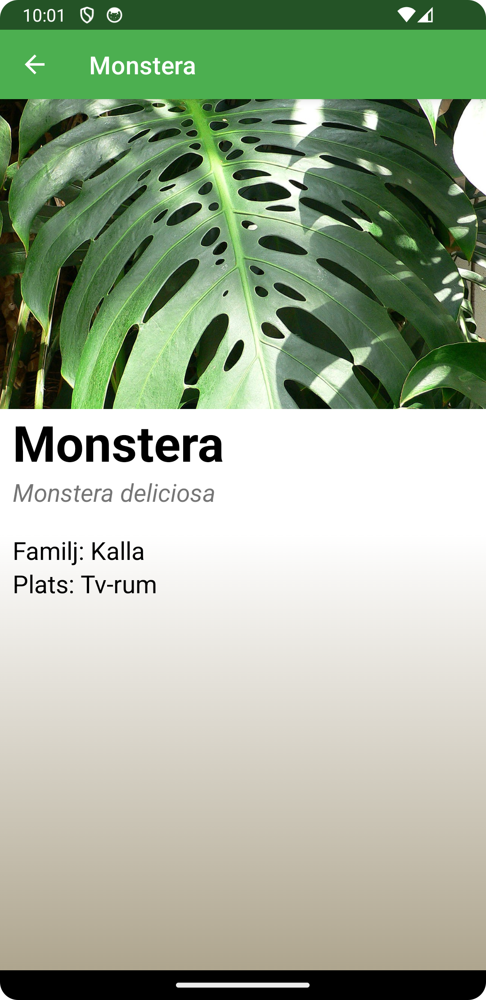
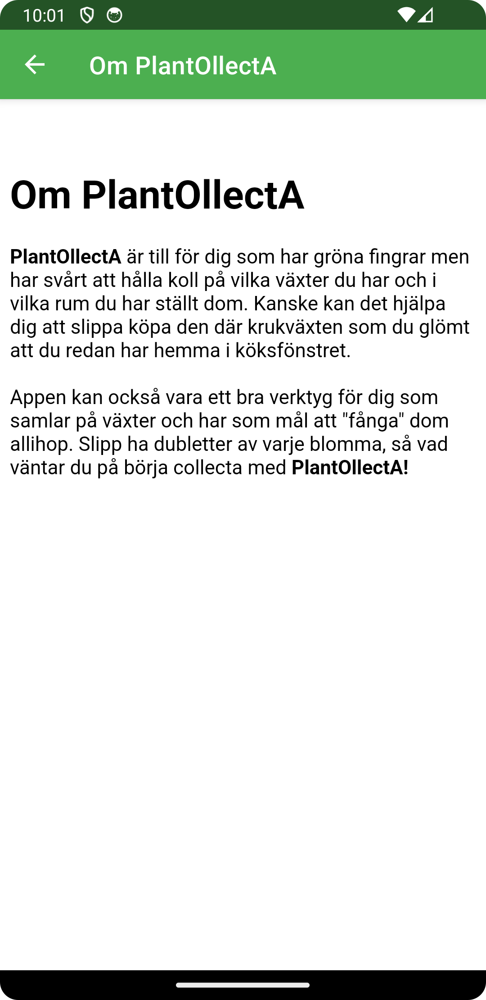
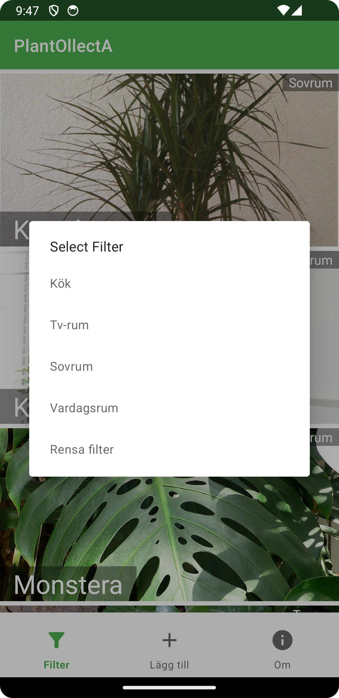
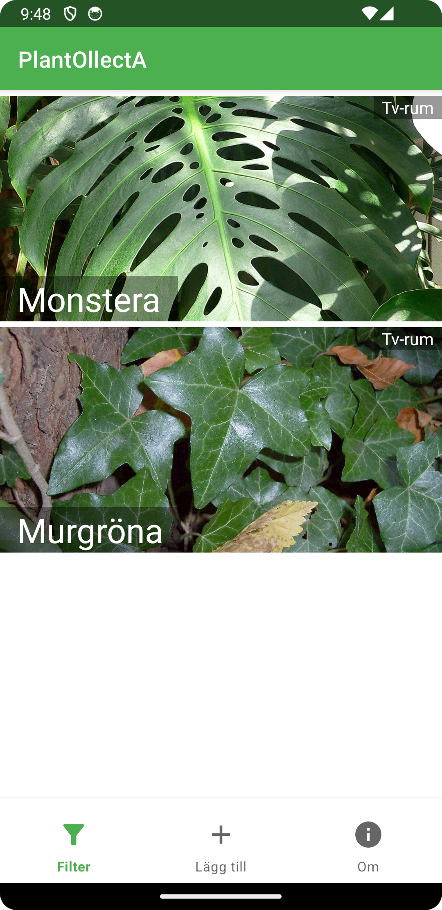
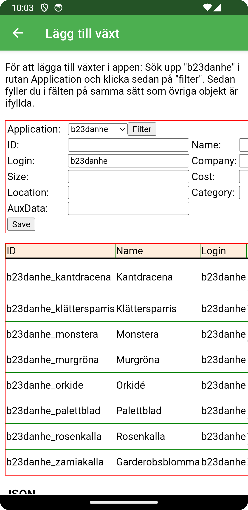

# Rapport

Detta projekt gick ut på att skapa en app som innehåller de alla olika delar som vi under kursen har lärt oss att implementera.

I en RecyclerView presenteras JSON-data som hämtas från en webbtjänst. För att göra det används följande kod där jag först
anger URLen och lagrar den i en String variabel som sedan skickas in i en instans av JsonTask som läser in datan från URLen.

```
private final String JSON_URL = "https://mobprog.webug.se/json-api?login=b23danhe";
new JsonTask(this).execute(JSON_URL);
```
Därefter omvanlas (unmarshall) raderna i JSON datan till object med hjälp av en instans av GSON som lagras i en ArrayList listOfPlantor.
Med hjälp av en adapter så skickas listan in till en RecyclerView. En click listener läggs på varje objekt för att göra det möjligt att
klicka på och få mer info om objektet. När man klickar på ett objekt så startas en ny activity med hjälp av en Intent. 
Genom att använda .putExtra går det att skicka data som ska användas i den nya activityn (PlantaActivity). Följande kod används i MainActivity för att skicka
data till PlantaActivity.

```
adapter = new RecyclerViewAdapter(this, listOfPlantor, new RecyclerViewAdapter.OnClickListener() {
            @Override
            public void onClick(Planta planta) {
                // Start the PlantaActivity and pass the planta details
                Intent intent = new Intent(MainActivity.this, PlantaActivity.class);
                intent.putExtra("name", planta.getName());
                intent.putExtra("latin", planta.getLatinName());
                intent.putExtra("room", planta.getLocation());
                intent.putExtra("family", planta.getFamily());
                intent.putExtra("image", planta.getImageUrl());

                startActivity(intent);
            }
        });
```

För att läsa in datan i PlantaActivity skapar jag en instans av Bundle som har just funktionen att ta emot data så att
den kan sparas i givna varibler som kan användas för att presentera datan i TexViews och ImageViews.

```
// Retrieve the data passed from the MainActivity
        Bundle extras = getIntent().getExtras();
        if (extras != null) {
            name = extras.getString("name");
            latin = extras.getString("latin");
            family = extras.getString("family");
            room = extras.getString("room");
            image = extras.getString("image");
        }
```

Jag implementerade ett filter som gör det möjligt att filtrera RecyclerViewn på Rum. Detta möjliggörs genom att först 
lägga till en meny längst ner på skärmen som innehåller en knapp som öppnar upp en dialogruta med alla olika rum som 
finns i JSON datan.

Genom en metod `showFilterDialog()` i MainActivity så skapas en instans av `MaterialAlertDialogBuilder` som skapar just en dialogruta.
I en HashSet lagras alla unika (HashSet tillåter bara unika värden) rum (location) i form av String som hämtas från listOfPlantor.
Denna HashSet lagras i `uniqueLocations` som sedan konverteras till en arraylist som lagras i `filterOptions`som sen går att skicka in
i `MaterialAlertDialogBuilder` som kan lista alla element i `filterOptions` som klickbara element i en dialogruta. Det elementet väljs skickas
sen vidare till RecyclerViewAdaptern som via en metod `filter` som läser in vilket rum som valts och lägger de plator med motsvaranade rum (location)
i filteredList som sen ersätter listan i variabeln `plantor`. FÖr att kunna återgå till en RecyclerView utan filter så finns original
listan med plantor sparade i en ArrayList (originalPlantor) som skickas in i variabeln `plantor` när användaren väljer att klicka på "Rensa Filter".

```
public void filter(String location) {
    if (location.equals("Rensa filter")) {
        // Resets to the original list
        plantor = new ArrayList<>(originalPlantor);
    }
    else {
        ArrayList<Planta> filteredList = new ArrayList<>();
        for (Planta planta : originalPlantor) {
            if (planta.getLocation().equalsIgnoreCase(location)) {
                // Adds plants that match the location
                filteredList.add(planta);
            }
        }
        plantor = filteredList;
    }
    // Notifies the adapter to refresh the RecyclerView
    notifyDataSetChanged();
}
```

För att göra det möjligt så att filtret som valts inte försvinner när användaren stänger ner appen och öppnar den igen. Så skapar jag
instanser av SharedPreferences där valt filter sparas.

```
// Initialize SharedPreferences
myPreferenceRef = getSharedPreferences(PREFERENCE_NAME, MODE_PRIVATE);
myPreferenceEditor = myPreferenceRef.edit();

// Save the selected filter in SharedPreferences
myPreferenceEditor.putString(FILTER_KEY, selectedFilter);
myPreferenceEditor.apply();
```
Här görs kollen om det finns någon lagrad SharedPreferences:

```
// Load and apply the preferred filter if it exists
String preferredFilter = myPreferenceRef.getString(FILTER_KEY, null);
if (preferredFilter != null) {
    currentFilter = preferredFilter.equals("Rensa filter") ? null : preferredFilter;
    adapter.filter(preferredFilter);
}
```
    
  